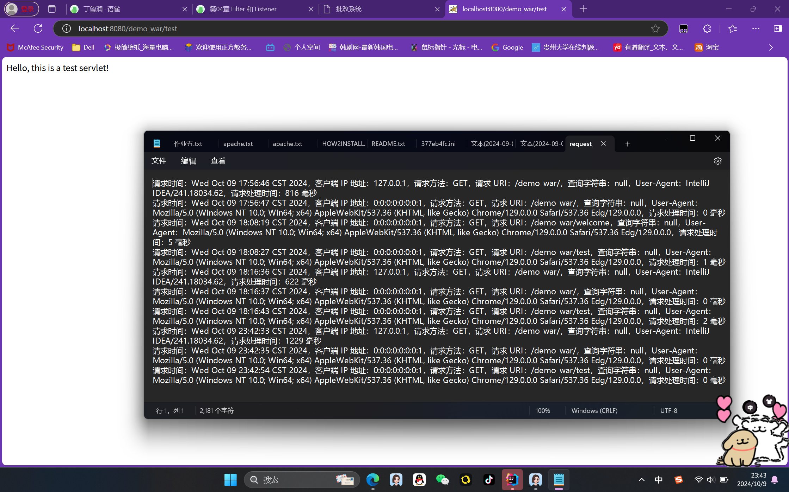

1.实现了一个 ServletRequestListener 来记录每个 HTTP 请求的详细信息。
2.记录的信息应包括：
o请求时间
o客户端 IP 地址
o请求方法（GET, POST 等）
o请求 URI
o查询字符串（如果有）
oUser-Agent
o请求处理时间（从请求开始到结束的时间）
1.在请求开始时记录开始时间，在请求结束时计算处理时间。
2.日志存放于tomcat/bin/request_log.text。
3.实现了一个简单的测试 Servlet，用于验证日志记录功能。
4.